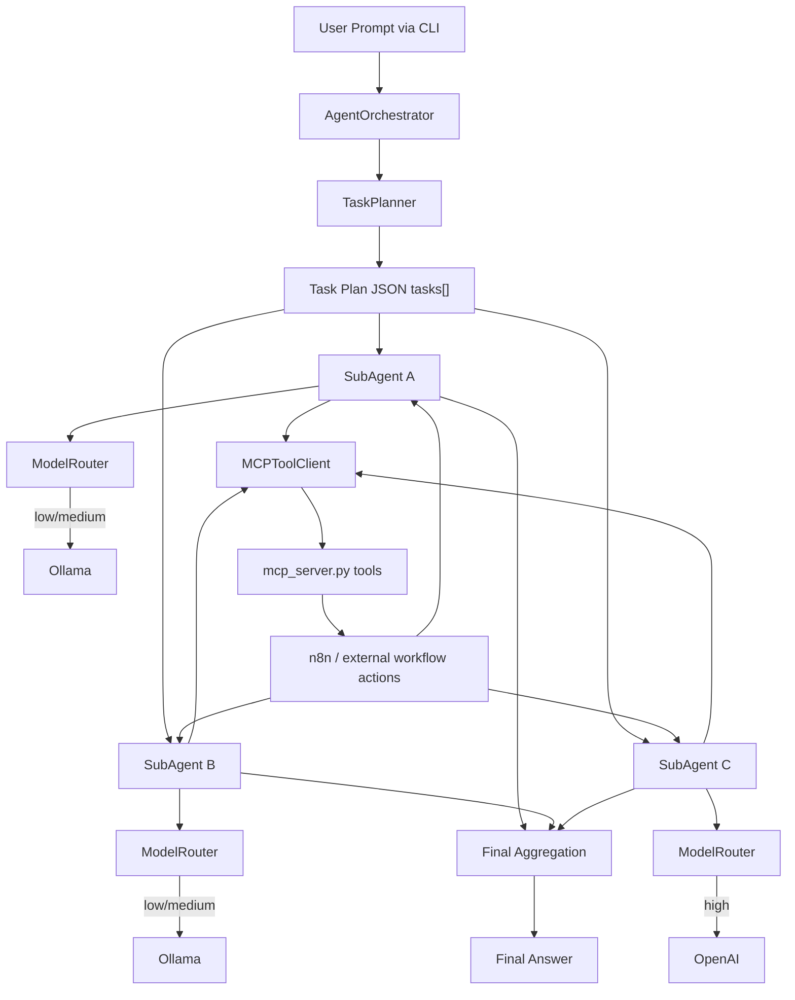

# ReAct AI Agent Orchestrator for Spawning Parallel Subagents with MCP

Personal CLI AI agent using local/remote LLMs and **ReAct (Reasoning + Action)** with an MCP server for tool calling.

This project implements:
- **Model routing** (Ollama for low/medium complexity, OpenAI for high complexity)
- **Task planning** from a single user prompt
- **Dynamic subagent spawning**
- **Concurrent execution** of subagents via `asyncio.gather(...)`
- **MCP tool calls** to run automated workflows (for example n8n-backed email/calendar/social actions)

---

## What this repo is

A Python CLI orchestrator where:
1. You provide one prompt.
2. A planner creates structured sub-tasks.
3. Subagents execute those tasks in parallel using ReAct loops.
4. Subagents call MCP tools.
5. Final output is aggregated into one user-facing response.

`mcp_server.py` exposes tool endpoints, and `react_agent.py` is the orchestrator runtime.

---

## High-Level Architecture



---

## Core Components

### 1) ModelRouter
Routes model calls by task complexity:
- `low` → Ollama small model (default `llama3`)
- `medium` → Ollama larger model (default `mistral`)
- `high` → OpenAI model (default `gpt-4o`)

This allows local models for cheaper/faster simple tasks while escalating harder reasoning to OpenAI.

### 2) TaskPlanner
Generates a structured plan before execution:

```json
{
  "tasks": [
    {
      "agent_type": "email",
      "instruction": "summarize inbox and identify urgent threads",
      "complexity": "low"
    },
    {
      "agent_type": "calendar",
      "instruction": "schedule follow-up reminders tomorrow at 10:00",
      "complexity": "medium"
    }
  ]
}
```

### 3) SubAgent
Each planned task becomes a `SubAgent` worker with:
- task instruction
- MCP tool access
- complexity-aware model routing

Each subagent uses a strict ReAct loop format:
- `Action: {"tool":"...","arguments":{...},"reason":"..."}`
- `Final: "..."`

### 4) Concurrent execution
All subagents are run in parallel:

```python
results = await asyncio.gather(*(agent.execute() for agent in subagents))
```

### 5) MCP integration
Subagents call tools through `MCPToolClient`, which communicates with `mcp_server.py` over stdio.
Each MCP tool can trigger an automation workflow (for example n8n webhooks).

---

## ReAct Loop (inside each SubAgent)

1. Send current context to routed model.
2. Parse model output as either `Action` or `Final`.
3. If `Action`:
   - validate tool name + arguments
   - call MCP tool
   - append observation to next prompt
4. If `Final`: return result for aggregation.
5. Repeat until completion or max steps.

---

## CLI Usage

### Basic
```bash
python react_agent.py --prompt "Summarize unread emails and schedule follow-up tomorrow at 10am"
```

### With explicit model routing config
```bash
python react_agent.py \
  --prompt "Summarize unread emails and schedule follow-up tomorrow at 10am" \
  --openai-model gpt-4o \
  --ollama-small-model llama3 \
  --ollama-large-model mistral \
  --ollama-base-url http://localhost:11434 \
  --mcp-server mcp_server.py \
  --max-subagent-steps 6
```

---

## End-to-End Example: Prompt → Routing → Parallel Subagents → Workflow

### Input Prompt
```text
Summarize unread emails, draft a social update from key highlights, and schedule follow-up reminders tomorrow at 10am.
```

### Planned Tasks 
```json
{
  "tasks": [
    {"agent_type": "email", "instruction": "summarize unread inbox and urgent items", "complexity": "low"},
    {"agent_type": "social", "instruction": "draft a short post from the summary", "complexity": "medium"},
    {"agent_type": "calendar", "instruction": "schedule follow-up reminders tomorrow at 10:00", "complexity": "high"}
  ]
}
```

### Model Routing Decisions 
- Email subagent (`low`) → **Ollama / llama3**
- Social subagent (`medium`) → **Ollama / mistral**
- Calendar subagent (`high`) → **OpenAI / gpt-4o**

### Parallel Subagent Work 
- SubAgent(email) calls MCP tool: `email_process`
- SubAgent(social) calls MCP tool: `social_post`
- SubAgent(calendar) calls MCP tool: `calendar_schedule`

All run concurrently and return individual results.

### Aggregated Final Output 
```text
Done. I summarized your unread emails and highlighted urgent threads, drafted and posted a social update with the key highlights, and scheduled follow-up reminders for tomorrow at 10:00.
```

---

## Notes

- The orchestrator currently runs one prompt per CLI invocation.
- MCP server logic lives in `mcp_server.py`; orchestrator logic lives in `react_agent.py`.
- You can swap models via CLI flags/environment variables without changing orchestration code.
